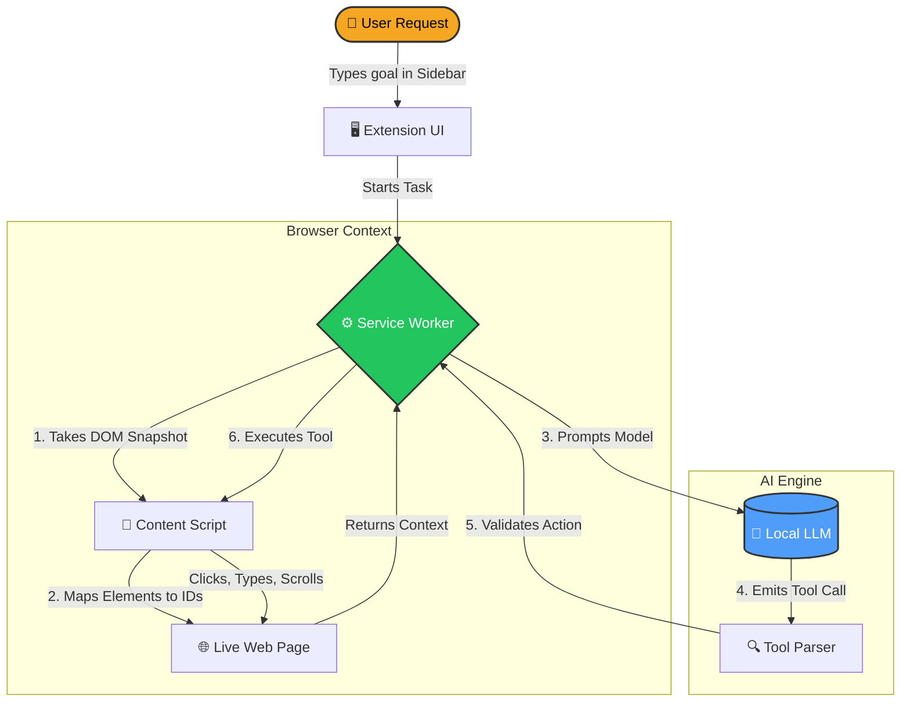

<div align="center">

# 🌐 WebNav
**The Local AI Browser Agent for Developers**

[](https://opensource.org/licenses/MIT)
[](https://developer.chrome.com/docs/extensions/mv3/)
[](#)
[](#)

*Drive your browser completely hands-free using powerful, open-source local AI models.*<br>
*Built with Manifest V3. No cloud lock-in. No subscription fees. 100% privacy.*

</div>

---

## ⚡ What is WebNav?

WebNav is a developer-friendly Chrome Extension that turns open-source AI models (via Ollama, LM Studio, vLLM) into autonomous browsing agents. You give it a high-level task, and it clicks, types, scrolls, and extracts data to accomplish it on your behalf. 

Because it connects directly to local OpenAI-compatible endpoints, **your browsing data never leaves your machine.**

### Why Developers Love It
- **Zero Dependencies**: Pure Vanilla JS, no build steps, no React/Webpack bloat. 
- **Manifest V3 Native**: Resilient service-worker architecture that survives aggressive browser suspension.
- **Transparent Execution**: Watch the AI "think" and interact in real-time through the side panel.
- **Hackable**: Easy to add custom tools or tweak the parser logic for different LLMs.

---

## 🚀 Use Cases

| 🕵️‍♂️ Research & Summarization | 🛠️ QA & Automation | 📊 Data Extraction | 🔒 Privacy-First Tasks |
| :--- | :--- | :--- | :--- |
| "Search for the latest papers on Transformer models and summarize the top 3." | "Go to my staging site, login with user/pass, and verify the checkout button works." | "Open Amazon, search for 34-inch monitors, and list the top 5 prices." | "Read this internal company document and draft an email response." |

---

## 🧠 How It Works (Architecture Flow)



---

## ⚙️ Getting Started

### 1. Requirements
- **Chrome** (version 114+)
- **Local AI Provider**: [Ollama](https://ollama.com/) (recommended), LM Studio, or vLLM.

### 2. Installation
1. Pull a tool-capable model (e.g., `ollama pull qwen2.5`).
2. Open `chrome://extensions` in your browser.
3. Enable **Developer mode** (top right toggle).
4. Click **Load unpacked** and select the downloaded `BrowserExt` folder.

### 3. Setup
1. The **Options page** will open automatically.
2. Ensure the **Base URL** points to your local server (e.g., `http://localhost:11434/v1` for Ollama).
3. Click **Test connection** to verify the extension can see your models.
4. Pin the extension to your toolbar, open the **Side Panel**, type a goal, and watch the magic!

---

## 🎯 Recommended Settings & Models

Not all models are good at driving browsers. The model *must* understand function calling / tool usage.

**Top Tier Models (Local):**
- 🥇 `qwen2.5` / `qwen2.5-coder` (Fast, incredibly accurate tool use)
- 🥈 `llama3.1` (Reliable, great reasoning)
- 🥉 `mistral-nemo` or `hermes-3`

**Extension Settings (Options Page):**
- **Allowlist Mode**: Start with `"Allow all non-blocked"` for the smoothest experience. 
- **Confirmation Mode**: Leave on `"Destructive Only"` — the AI will browse freely but ask for permission before clicking "Buy", "Submit", or downloading files.

---

## 🛡️ Built-in Safety Model

WebNav is designed to keep you safe from rogue AI actions and malicious websites (Prompt Injection).

- **Risk Tiers (R0 - R4)**: Every action is classified. Reading (R0) and clicking links (R1) happen instantly. Submitting forms (R3) always requires your explicit click-to-approve. File downloads (R4) are blocked entirely.
- **Domain Blacklist**: Hardcoded blocklists prevent the AI from navigating to banking, medical, or cloud-console domains unless you explicitly authorize it.
- **Prompt Defense**: Strips invisible Unicode characters from pages to prevent invisible prompt injection attacks.
- **Secret Redaction**: (Opt-in) Automatically redacts Social Security Numbers, API keys, and credit cards from the HTML before sending it to the LLM.

---

## 🛠️ The 14 Developer Tools

The agent interacts with the page using a highly restrictive, deterministic toolset.

```json
[
  "navigate(url)", "open_tab(url)", "switch_tab(tabId)",
  "read_page()", "extract_text(id)", "scroll(dir, amt)", 
  "wait_for(selector, timeout)", "refresh()", "back()",
  "click(id)", "type_text(id, text)", "press_key(key)", 
  "ask_user(question)", "finish(answer)"
]
```

## 📦 Releases & Automated Builds

We use GitHub Actions to automate extension packaging and releases. Whenever a new tag starting with `v` (e.g. `v0.1.0`) is pushed to the repository, a release zip file containing the unpacked extension is compiled and attached directly to the [GitHub Releases](https://github.com/rahulcvwebsitehosting/WebNav/releases) page.

To download and run a pre-packaged build:
1. Head over to the **Releases** page on GitHub.
2. Download the `webnav-extension-vX.Y.Z.zip` file from the latest release.
3. Unzip the archive.
4. Go to `chrome://extensions/` in Chrome, enable **Developer mode**, click **Load unpacked**, and select the extracted folder.

---

## 🤝 Contributing (Open Source)

WebNav is 100% open source, built with ❤️ for the developer community. No subscriptions, no cloud lock-in, no data leaving your machine — just pure, transparent, local AI browsing autonomy. I built this so every developer can experiment with and deploy browser agents without paying a cent or trusting a third party.

We welcome pull requests!

**Good First Issues:**
- Adding new models to the prompt parser.
- Enhancing the DOM scraper to understand Shadow DOMs.
- Adding custom CSS themes for the Side Panel.

## 📄 License

This project is licensed under the **MIT License**. Build on top of it, modify it, and make the web yours.

---

## 👨‍💻 About the Creator

**Rahul Shyam CV** — Independent developer and open-source enthusiast building tools that put AI autonomy back into developers' hands.

[](https://www.linkedin.com/in/rahulshyamcivil/)
[](https://x.com/RahulShyamCV)
[](https://www.threads.com/@rahulcvjps)

> *"I believe the future of browsing is agent-first, local-first, and open-source. WebNav is my contribution to that future — free, transparent, and built for developers by a developer."*

